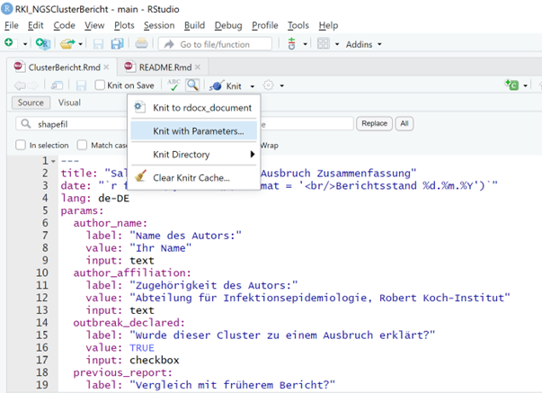
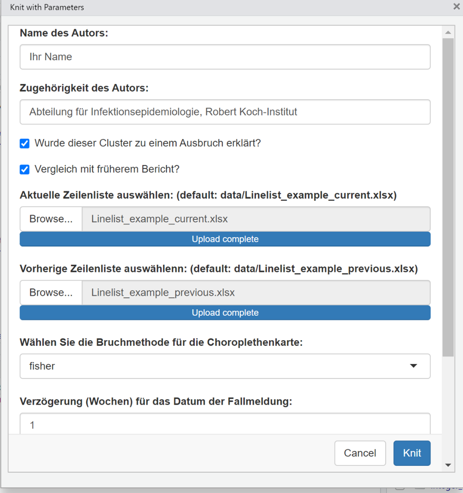
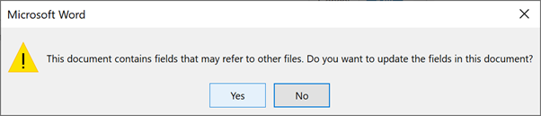

NGS Cluster Bericht
================
24 February 2026

<!-- README.md is generated from README.Rmd. Please edit that file -->

### Background:

This repository is for the development and maintenance of an R markdown
script for generating automated *Salmonella enterica*
Next-Generation-Sequencing (NGS) cluster situation reports for the
Robert Koch Institute.

### Structure:

The report is based on a Microsoft Excel template for case line lists
that is already used at RKI to generate the reports manually. The line
list template includes data from NRZ on any isolates belonging to the
NGS cluster, as well as corresponding case data from Survnet.
Cluster-specific case definitions are also extracted from the line list
workbook.

Supplementary files required to build the report are stored in the
`resources` folder:

- Data dictionary with column names and descriptions: `Datenlexikon.csv`
- Microsoft word template with RKI styles and logo:
  `vorlagendokument.docx`
- Serovar classification table: `Kauffman_White_classification.xlsx`
- Colour palate hexcodes for federal states (Bundesland):
  `BL Farbcode.xlsx`
- Population for federal states (Bundesland):
  `SBD_pop_12411_0010_DLAND_flat.csv`
- Population for counties (Kreise): `SBD_pop_12411_0015_KREISE_flat.csv`
- Population for Berlin districts: `SBD_pop_01_12_BERLIN_flat.csv`
- Shapefiles for Bundesland, Kreise and Berlin districts: `shapefiles`
  folder

Some information on the source of these files, how they have been
created and how to keep them up to date is provided below.

#### Custom Microsoft Word template with RKI branding:

The R markdown script knits the report to a Microsoft Word template with
custom formatting including the RKI logo, colours, pre-formatted headers
and footers called `vorlagendokument.docx`.

*=\> Note:* If any elements of the Microsoft Word template need to be
updated, open the template and follow the instructions in the R markdown
cookbook [chapter on custom word
templates](https://bookdown.org/yihui/rmarkdown-cookbook/word-template.html)
to edit the elements of interest.

#### Data dictionary with column names:

After the raw data is imported, **cleaned** variable names in long form
are re-assigned to their short form (used throughout the rest of the
script) via a lookup table from the `Datenlexicon.xlsx` (data
dictionary) file.

*=\> Note:* Required variables that are essential to create this report
are marked as `TRUE` in the `var_in_script` column of
`Datenlexikon.xlsx`. If the name of any of these essential variables
changes in the Microsoft Excel template, please update their names in
the `varname_data` column of `Datenlexicon.xlsx` and save the edits
before running the report. Be sure to replace any spaces and
non-alphanumeric characters in the revised names with an underscore `_`.
If you are not sure what the revised column name should look like after
cleaning, run this in the RStudio console:
`janitor::clean_names("revised col name (nonan)")` replacing ‘revised
col name (nonan)’ with the actual new name of the column as it appears
in the latest Microsoft excel line list template.

#### Source and updates for population files:

Population by Bundesland and Kreise were obtained from the Federal
Statistical Office of Germany - Statistisches Bundesamt, Genesis
database. The data were filtered to get population figures for the
latest available date (31 December 2022 at the time of download). The
following products were used:

- Bundesland: [refID: 12411-0010, Population: Länder, reference
  date](https://www-genesis.destatis.de/genesis//online?operation=table&code=12411-0010&bypass=true&levelindex=0&levelid=1696019743440#abreadcrumb)
- Kreise: [refID: 12411-0015, Population: Administrative districts,
  reference
  date](https://www-genesis.destatis.de/genesis//online?operation=table&code=12411-0015&bypass=true&levelindex=0&levelid=1696019743440#abreadcrumb)

These files will need to be updated on an annual basis.

Population for the 12 Berlin districts was extracted from the `Geo_LK`
worksheet of the line list template (dated 06 June 2023). This file will
also need to be reviewed and updated on an annual basis.

#### Source and updates for shapefiles:

Shapefiles for federal states (Bundesland) were obtained from the
[Federal Agency for Cartography and Geodesy
(BKG)](https://daten.gdz.bkg.bund.de/produkte/vg/vg2500/aktuell/vg2500_12-31.utm32s.shape.zip).
The open data product was selected (UTM32s projection) as it is
available for public use.

Shapefiles for Kreise and Berlin districts were obtained from an
internal RKI source that had been adapted for COVID-19 case reports.
This is because there is no official shapefile dataset for Berlin
districts; rather they are comprised of several Gemeinden and thus
represent an intermediate layer between Gemeinden and Kreise. The
projection used is ETRS89 so it is transformed to WGS84 to be compatible
with the other shapefiles.

Another convenient source that could be used in the future is the [GADM
data](https://gadm.org/download_country_v3.html) which has 5
administrative levels for Germany and conveniently has downloads already
prepared in sf format as `.rds` files that could be directly imported
into r with `rio::import()`. The projection used for these datasets is
WGS84 and latitude/longitude.

The shapefiles may need to be reviewed annually in case of any border
changes.

### Creating a report

#### Setup and requirements:

If running this report for the first time on a new computer, complete
the following setup steps first:

1.  Either ask your IT department to help you install the software below
    in `Program files` of your computer (requires admin rights), or
    alternatively, create a subfolder called `R` in the `documents`
    folder of your computer and install everything there (should not
    require admin rights)
2.  Download and install the [latest version of
    R](https://cran.r-project.org/) from CRAN (required: R version 4.3.0
    or greater)
3.  Download and install the [latest version of
    Rtools](https://cran.r-project.org/bin/windows/Rtools/) from CRAN
    (note: this must match your version of R - should be Rtools version
    43 or greater)
4.  Download and install the [latest version of
    RStudio](https://posit.co/download/rstudio-desktop/) from Posit
    (required: RStudio version 2023.06.0 build 421 or greater)
5.  Download and unzip [this project
    folder](https://github.com/AmyMikhail/RKI_NGSClusterBericht/archive/refs/heads/main.zip)
    to your computer
6.  Open RStudio and using the file menu, navigate to and open
    `packages2install.R` which you will find in the `R` subfolder of the
    `RKI_NGSClusterBericht` folder on your computer.
7.  Run the whole `packages2install.R` script to install all the
    required packages (note: this may take some time - monitor console
    output to check for any problems).

Alternatively, copy and paste the script below into your RStudio console
and run it to install required packages:

``` r

###############################################################
# INSTALL PACKAGES
###############################################################

# 1. Remotes (required for installing packages from Github):
if (!requireNamespace("remotes", quietly = TRUE)) install.packages("remotes")

# 2. Pacman (required for installing and loading all required packages):
if (!requireNamespace("pacman", quietly = TRUE)) install.packages("pacman")

# 3. Install all required CRAN packages:
pacman::p_load(
  
  # Packages required to build report:
  rmarkdown,      # Used to generate the R markdown report
  knitr,          # Used to knit the R markdown report to an output format
  shiny,          # Required to show Shiny app with parameters/options menu
  bookdown,       # Enhance autonumbering in report with German language
  officedown,     # Enhance autonumbering in report with German language
  officer,        # Enables various functions specific to Microsoft Word output
  
  # Importing data:
  here,           # Enables use of relative file paths
  rio,            # Functions to import data
  janitor,        # Autocleaning of column names and creation of simple tables
  
  # Summary tables:
  flextable,      # Creation of publication-quality editable tables
  ftExtra,        # Additional functions for creating flextables
  ztable,         # Functions to convert a table of numeric data to a heatmap
  gtsummary,      # Publication-ready summary tables
  
  # Graphs:
  gridExtra,      # Arranging multiple ggplots in columns
  ggrepel,        # Repel text labels on ggplots to improve readability
  ggtext,         # Additional functions to label ggplots
  scales,         # Functions to edit ggplot x and y axis scales
  
  # Maps:
  sf,             # Functions to import and manipulate shapefiles
  mapsf,          # Function to calculate class intervals for choropleth maps
  ggmap,          # Theme for maps produced with ggplot
  
  # Descriptive epi functions:
  epikit,         # Function to calculate age groups from single year ages
  apyramid,       # Function to create age sex pyramid
  
  # Tidyverse packages (all required in this report):
  # dplyr, tidyr, lubridate, stringr, ggplot2, forcats, purrr, tibble & readr 
  tidyverse       # Shortcut to load 9 main tidyverse packages in one go
)

# 4. All required GitHub packages:
pacman::p_load_gh("yutannihilation/ggsflabel")


# 5. Install latex (tinytex) - required to knit report to MS word or pdf:
tinytex::install_tinytex()
```

#### Running a report:

This report is currently provided as a parameterised R markdown report,
which can be run from RStudio by opening the `ClusterBericht.Rmd` file
in the root of the `RKI_NGSClusterBericht` folder on your computer and
selecting `Knit with parameters` from the knit menu. This will bring up
a shiny app which you can use to select the options you would like to
use to run the report. Example data has been provided for demonstration
and testing, however please note this is only available to authorised
personnel (contact the repository maintainer to request access).

<figure>

<figcaption aria-hidden="true">Fig. 1 - selecting knit with
params…</figcaption>
</figure>

Currently you can choose from the following options:

- `Name des autors:` enter the name of the person running the report
  here
- `Zugehörigkeit des Autors:` edit the affiliation of the person running
  the report, if necessary (defaults to RKI)
- `Wurde dieser Cluster zu einem Ausbruch erklärt?` tick the checkbox if
  the cluster has already been declared as an outbreak, otherwise untick
  (default is ticked)
- `Vergleich mit früherem Bericht?` tick the checkbox if you wish to
  compare the summary figures from the latest line list with a previous
  line list (default is unticked)
- `Testbericht mit Beispieldaten?` tick the checkbox if you wish to use
  the example data, to test or adapt the report (if yes you will need to
  supply the password, see below)
- `Datenkennwort:` If using the example data provided in the data
  folder, enter the password to decrypt the data here (provided
  separately)
- `Aktuelle Zeilenliste auswählen:` click the browse button to navigate
  to the current (latest) line list for this cluster/outbreak on your
  computer and select it to upload (mandatory)
- `Vorherige Zeilenliste auswählenn:` click the browse button to
  navigate to the previous line list for this cluster/outbreak on your
  computer and select it to upload (required if
  `Vergleich mit früherem Bericht?` has been ticked)
- `Wählen Sie die Bruchmethode für die Choroplethenkarte:` select the
  class interval method to use when constructing the choropleth map of
  case incidence from the drop-down menu (defaults to fisher)
- `Verzögerung (Wochen) für das Datum der Fallmeldung:` if desired, edit
  the number of weeks to use as a lag when estimating case notification
  dates (defaults to 1 week)
- `Verzögerung (Wochen) für das Eingangsdatum der Probe:` if desired,
  edit the number of weeks to use as a lag when estimating sample
  receipt dates (defaults to 1 week)
- `Stratifikator für Epikurven auswählen:` select variable to use as
  stratifier for the epicurve (defaults to federal states (Bundesland),
  other option is case definitions (Falldefinition))

<figure>

<figcaption aria-hidden="true">Fig. 2 - select report
parameters</figcaption>
</figure>

When you have completed your selections and edits, click on the `knit`
button at the bottom of the Shiny app. This will generate the report,
which will automatically open in Microsoft Word. Upon opening, you will
see a message saying ‘Dieses Dokument enthält Felder, die auf andere
Dateien verweisen können. Möchten Sie die Felder in diesem Dokument
aktualisieren?’ Click `Ja` (yes) to ensure that the table of contents is
included in the report.

<figure>

<figcaption aria-hidden="true">Fig. 3 - select yes to insert table of
contents</figcaption>
</figure>

*=\> Note:* The generated report will be called `ClusterBericht.docx`.
If you are satisfied with the generated report, change the file name
(e.g. use the title of the current cluster or outbreak and today’s date)
and move the file to another location on your computer. If this is not
done, the next time the report is run, it will overwrite the previous
one. Note that the report cannot be generated if a document of the same
name is still open in Microsoft Word.

### Future enhancements:

The following enhancements are planned in the near future:

- Creation of a more advanced Shiny app allowing selection of figure
  options and preview of the results before knitting the report.
- The project will be converted to an R package to ensure all dependent
  packages are installed before the first report is run.
- When these updates are applied, the instructions on this page will
  also be updated.

### Acknowledgements:

This material is based on a template provided by the Robert Koch
Institute. [Jan Walters](mailto:WalterJ@rki.de) and [Anika
Meinen](mailto:MeinenA@rki.de) are the owners of this project, defined
the specifications, provided the initial examples and templates and are
responsible for beta-testing development versions. [Amy
Mikhail](https://github.com/AmyMikhail) is the author and maintainer of
the code.

### Reporting errors and bugs or requesting enhancements:

To report problems (errors or bugs in the code or report output), please
create a new [issue
here](https://github.com/AmyMikhail/RKI_NGSClusterBericht_Teilen/issues).
Copy the error from your R console and paste it into the issue box.
Please also provide any additional descriptions about what went wrong in
the issue text and make sure to label it as a `bug` before posting.

You can also create a new issue to request new features or enhancements
to the existing report (select `enhancement` or `documentation` labels
as appropriate).

### Maintenance:

This project is currently being maintained by [Amy
Mikhail](https://github.com/AmyMikhail).

Contributions are welcome: please contact the maintainer to request
access.
